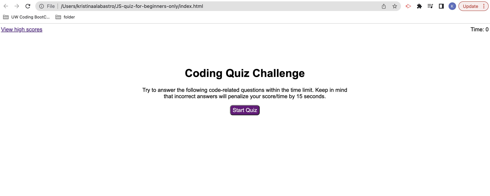

# Beginner Coding Multiple Choice Quiz

## Description 

We have all been there before. Coding was once new for us all. This quiz was designed specificially for those new to the game of coding with limited to no understanding of coding. Here you will have 5 questions that test your beginner coding knowledge to help you get started with understanding the basics. You will have 75 seconds to complete the test, but beware as the time will decrement if an incorrect answer is chosen. 

## Licenses

N/A

## Usage

To begin the quiz, first read the instructions. The start button is located in the center of the page and will begin the timer of 75 seconds. The first multiple choice question will pop up with 4 options. Beware as an incorrect answer will deduct your time by 15 seconds. Choosing the correct answer will add an extra second to your timer. This continues for all five questions. Once you reach the last and final question, each of the options will move you to the end screen that presents your score and enables you to add your initials that will then be saved to local storage for later access. When you have reached the end, you can circle back and start the quiz from the beginning or view your highscores.

### Screenshots of the Website

### Link To Live Webpage
https://kristinaa7.github.io/coding-quiz-for-beginners-only/

## Credits
N/A
